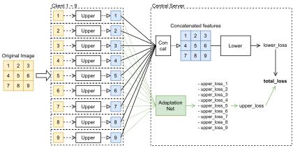

# Patch-SplitNN - Official PyTorch Implementation

<div align="center">
    
</div>

**Patch-based Privacy Preserving Neural Network for Vision Tasks** <br/>
This paper will be appeared on IEEE/CVF Winter Conference on Applications of Computer Vision (WACV) 2023.

## Requirements
- `h5py`: 3.7.0
- `hydra-core`: 1.2.0
- `lightning-bolts`: 0.4.0
- `pytorch-lightning`: 1.6.1
- `torch`: 1.12.0
- `torchvision`: 0.13.0 (>= ver 0.12.0 supports `PCAM` dataset )
- `thop`: 0.1.1

For details, see `requirements.txt`.

## Dataset
- [CIFAR-10 and CIFAR-100](https://www.cs.toronto.edu/~kriz/cifar.html)
- [PCAM (Patch Camelyon)](https://github.com/basveeling/pcam)

## Training
### Parameters
- `data_dir`: path to dataset directory.
- `logger`: `tensorboard` or `wandb` can be used.
- `dataset`: `CIFAR10`, `CIFAR100`, `PatchCIFAR10`, `PatchCIFAR100`, or `PCAM`.
- `base_model`: `resnet18` or `resnet34`
- `patch_size`: the size of patch images.
- `patch_stride`: the stride size for splitting.
- `num_uppmodels`: the number of upper models for Patch SplitNN.
- `adapt_net`: if `True`, *Adaptation Net* is set. 
- `upp_loss_ratio`: Coefficient value for loss function of upper loss.
- `drop_rate`: the ratio of dropping patches.

### CIFAR
- Move to `cifar` folder.
```sh
$ cd cifar
```

- ResNet (Reference model) training.
```sh
$ python resnet_cifar_main.py
```

- Patch SplitNN
```sh
$ python patch_splitnn_cifar_main.py adapt_net=False
```

- Patch SplitNN+
```sh
$ python patch_splitnn_cifar_main.py adapt_net=True
```

### PCAM
- Before training, dataset should be downloaded. Then set the path to `config.yaml`.

- Move to `pcam` folder.
```sh
$ cd pcam
```

- ResNet (Reference model) training.
```sh
$ python resnet_pcam_main.py
```

- Patch SplitNN
```sh
$ python patch_splitnn_main.py adapt_net=False
```

- Patch SplitNN+
```sh
$ python patch_splitnn_main.py adapt_net=True
```

### Docker
> [NVIDIA Container Toolkit](https://github.com/NVIDIA/nvidia-docker) is needed.

- Build docker image
```sh
$ docker build -f docker/Docker . -t <image_name>
```
- Run docker image
```sh
$ docker run --rm \
             --gpus all \
             -v /path/to/patch-splitnn:/opt/patch-splitnn \
             -it <image_name> \
             /bin/bash
$ cd /opt/patch-splitnn
```


### Citation
```bibtex
@InProceedings{PatchSplitNN_2023_WACV,
    author = {Mitsuhiro Mabuchi and Tetsuya Ishikawa},
    title = {Patch-based Privacy Preserving Neural Network for Vision Tasks},
    booktitle = {To be appeared. Proceedings of the IEEE/CVF Winter Conference on Applications of Computer Vision (WACV)},
    month = {January},
    year = {2023}
}
```